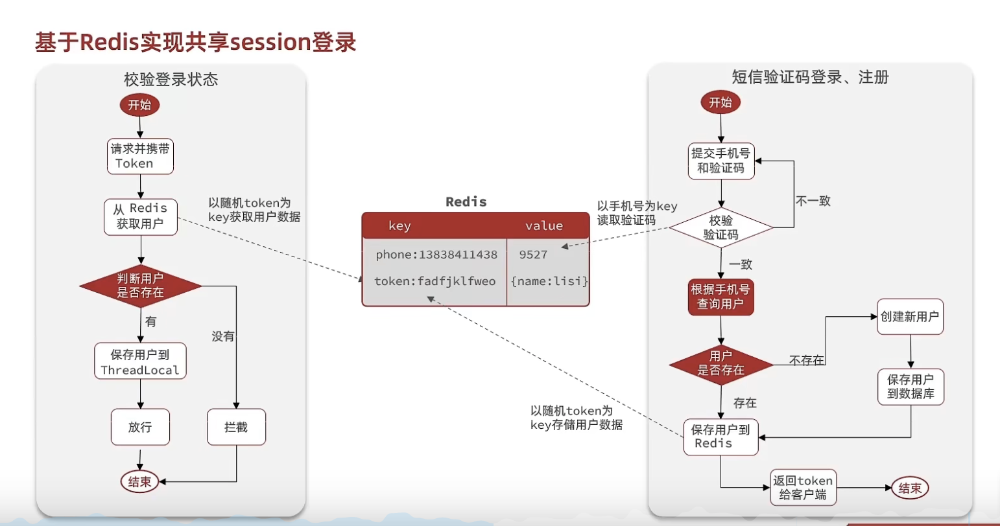

# 基于Redis实现共享session登录


业务代码雷同于基于session 实现登录，基于之前的基础，二次改造！




## 发送验证码

```java
// session.setAttribute("code", code);

// 替换成 基于redis存储 code 
stringRedisTemplate.opsForValue()
        .set(RedisConstants.LOGIN_CODE_KEY, code, RedisConstants.LOGIN_CODE_TTL, TimeUnit.MINUTES);
```


## 登录

```java
// session.setAttribute("user", BeanUtil.copyProperties(user, UserDTO.class));

// 下面为基于redis 存储用户信息

        // 生成随机Token
        String token = UUID.randomUUID().toString(true);

        // 将User对象转化未HashMap 存储 （hutool）
        UserDTO userDTO = BeanUtil.copyProperties(user, UserDTO.class);
        // 过滤空
        Map<String, Object> userMap = BeanUtil.beanToMap(userDTO, new HashMap<>(),
                CopyOptions.create().setIgnoreNullValue(true).setFieldValueEditor((fieldName, fieldValue) -> fieldValue.toString())
        );

        String tokenKey = RedisConstants.LOGIN_USER_KEY + token;
        stringRedisTemplate.opsForHash().putAll(tokenKey, userMap);
        stringRedisTemplate.expire(tokenKey, RedisConstants.LOGIN_USER_TTL, TimeUnit.MINUTES);

```


## 拦截器优化

解决用户请求刷新token问题

### LoginInterceptor 优化

```java
public class LoginInterceptor implements HandlerInterceptor {

    @Override
    public boolean preHandle(HttpServletRequest request, HttpServletResponse response, Object handler) throws Exception {

        if (UserHolder.getUser() == null) {
            // 设置状态
            response.setStatus(401);
            // 拦截
            return false;
        }
        return true;
    }
}
```


### 新增RefreshTokenInterceptor


```java
public class RefreshTokenInterceptor implements HandlerInterceptor {

    private StringRedisTemplate stringRedisTemplate;

    public RefreshTokenInterceptor(StringRedisTemplate stringRedisTemplate) {
        this.stringRedisTemplate = stringRedisTemplate;
    }


    @Override
    public boolean preHandle(HttpServletRequest request, HttpServletResponse response, Object handler) throws Exception {

        // 从Http 请求头获取 token 信息
        String token = request.getHeader("token");
        if (StrUtil.isBlank(token)) {
            // 不存在 拦截 返回 401
            response.setStatus(401);
            return false;
        }

        String key = RedisConstants.LOGIN_USER_KEY + token;
        Map<Object, Object> userMap = stringRedisTemplate.opsForHash().entries(key);
        if (userMap.isEmpty()) {
            response.setStatus(401);
            return false;
        }
        UserDTO userDTO = BeanUtil.fillBeanWithMap(userMap, new UserDTO(), false);

        UserHolder.saveUser(userDTO);


        stringRedisTemplate.expire(key, RedisConstants.LOGIN_USER_TTL, TimeUnit.MINUTES);

        return true;
    }


    @Override
    public void afterCompletion(HttpServletRequest request, HttpServletResponse response, Object handler, Exception ex) throws Exception {
        // 移除用户
        UserHolder.removeUser();
    }

}
```


### 注册拦截器

```java
// 解决状态刷新登录问题
registry.addInterceptor(new RefreshTokenInterceptor(stringRedisTemplate)).addPathPatterns("/**").order(0);
```


