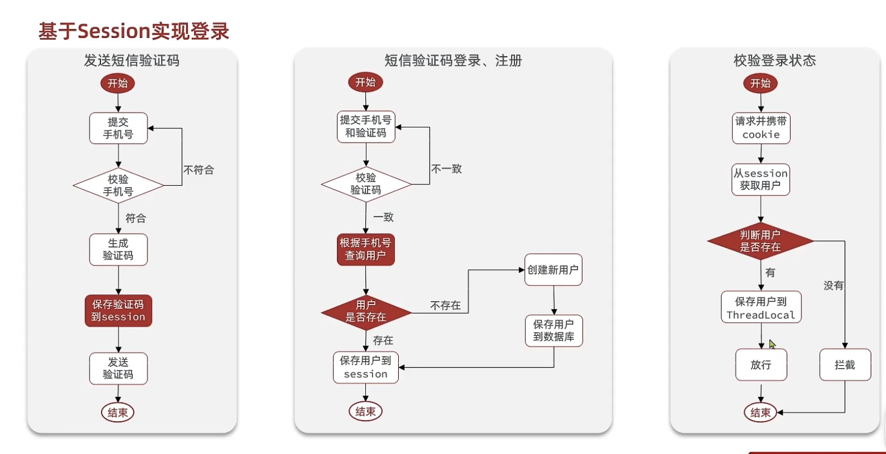
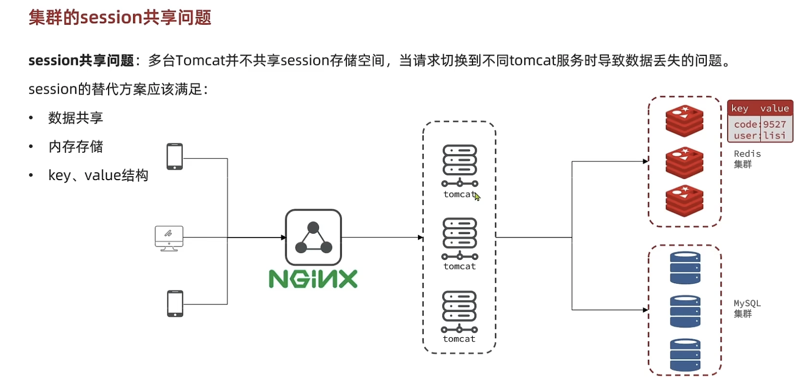

# 基于Session方案实现登录方案


## 实现思路




## 发送验证码

```java
 public Result sendCode(String phone, HttpSession session) {
        // 校验手机号
        if (RegexUtils.isPhoneInvalid(phone)) {
            //如果不符合，返回错误信息
            return Result.fail("手机号格式错误");
        }
        // 3. 符合 生成验证码
        String code = RandomUtil.randomNumbers(6);

        // 保存验证码的Session
        session.setAttribute("code", code);

        log.debug("发送验证码成功，验证码:{}", code);

        return Result.ok();
    }
```

## 登录校验


```java
public Result login(LoginFormDTO loginForm, HttpSession session) {
    // 1. 校验手机号
    String phone = loginForm.getPhone();
    if (RegexUtils.isPhoneInvalid(phone)) {
        return Result.fail("手机号格式错误！");
    }
    // 2. 校验验证码
    Object cacheCode = session.getAttribute("code");
    String code = loginForm.getCode();
    if (cacheCode == null || !cacheCode.toString().equals(code)) {
        return Result.fail("验证码错误");
    }
    User user = query().eq("phone", phone).one();

    if (user == null) {
        user = createUserWithPhone(phone);
    }
    session.setAttribute("user", BeanUtil.copyProperties(user, UserDTO.class));

    return Result.ok();
}

private User createUserWithPhone(String phone) {
    User user = new User();
    user.setPhone(phone);
    user.setNickName(RandomUtil.randomString(10));
    return null;
}
```


## 拦截器配置


```java
// 拦截器
public class LoginInterceptor implements HandlerInterceptor {

    @Override
    public boolean preHandle(HttpServletRequest request, HttpServletResponse response, Object handler) throws Exception {

        // 1. 获取session
        HttpSession session = request.getSession();
        // 2.获取session中的用户

        Object user = session.getAttribute("user");

        if (user == null) {
            // 不存在 拦截 返回 401
            response.setStatus(401);
            return false;
        }
        UserHolder.saveUser((UserDTO) user);

        return true;
    }
}


// 配置拦截器信息
@Configuration
public class MvcConfig implements WebMvcConfigurer {
    @Override
    public void addInterceptors(InterceptorRegistry registry) {

        registry.addInterceptor(new LoginInterceptor())
                .excludePathPatterns(
                        "/shop/**",
                        "/voucher/**",
                        "/shop-type/**",
                        "/upload/**",
                        "/blog/hot",
                        "/user/code",
                        "/user/login"
                );
    }
}
```


## 工具类信息

```java
public class UserHolder {
    private static final ThreadLocal<UserDTO> tl = new ThreadLocal<>();

    public static void saveUser(UserDTO user){
        tl.set(user);
    }

    public static UserDTO getUser(){
        return tl.get();
    }

    public static void removeUser(){
        tl.remove();
    }
}
```


## 集群的Session共享问题

